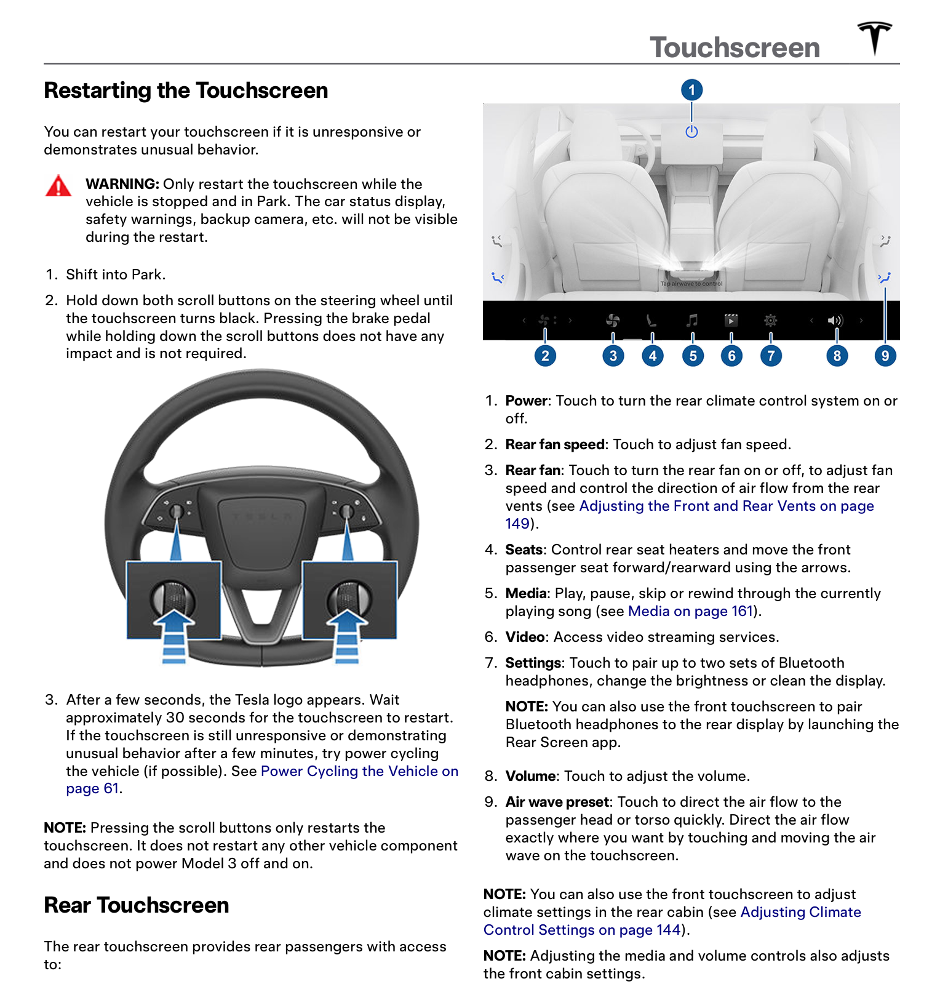
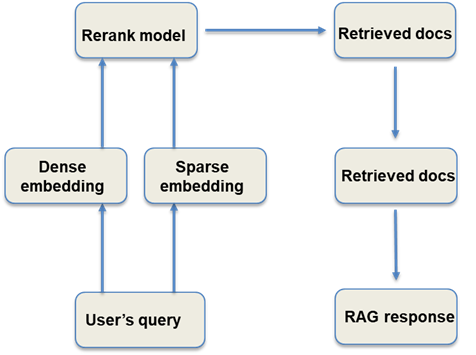

# Smart Car Knowledge Brain

This project belongs to large language model (LLM) Retrieval-augmented generation (RAG) task. It uses the Tesla owner's manual to build a knowledge base, and then selects relevant knowledge in the base to assist in the generation of LLM. It is mainly divided into three parts: building a knowledge base, knowledge retrieval, and answer generation.

### 1、Structure of the project

```text
.
├── Dockerfile                     # docker file
├── README.md                      # readme file
├── bm25_retriever.py              # BM25 retrieval
├── build.sh                       # 
├── data                           # data folder
│   ├── input.json                 # the question dataset 
│   ├── output.json                # RAG response 
│   └── train_a.pdf                # car manual file
├── faiss_retriever.py             # faiss retrieval
├── vllm_model.py                  # vllm file to implement vllm framework 
├── pdf_parse.py                   # pdf parse file
├── pre_train_model                # pretrain models including base llm (qwen 7b) and rerank model bge 
│   ├── Qwen-7B-Chat               # Qwen-7B base model 
│   │   └── download.py            # use this python file to download qwen 7B 
│   ├── bge-reranker-large         # bge rerank model
│   
├── qwen_generation_utils.py       # qwen utility functions from alibaba 
├── requirements.txt               # required packages 
├── rerank_model.py                # rerank python file
├── run.py                         # main file                         
└── run.sh                         # main script             
```

### 2 、Introduction

#### 2.1 Document retrieval question answering based on large models

Task: The project creates a Q&A system centered around LLMs to answer users' car-related questions. The system needs to locate the relevant information in the documents based on the questions and generate corresponding answers using LLMs according to the document content. The questions involved in this project mainly revolve around car usage, maintenance, and care. Specific examples are as follows:

question: "How can I use voice commands to control various aspects of my Tesla Model 3?" 

answer: "To use voice commands to control various aspects of your Tesla Model 3, you will need to enable the built-in voice recognition system by going to Settings > Voice Control. Once enabled, you can activate voice commands by saying \"Hey Tesla\" followed by the command you wish to execute.",


#### 2.2 dataset

Train data：




### 3、Methods

#### 3.1 PDF parser
- **PDF Sliding Window Parsing**: This method splits the document by periods and then constructs a sliding window. The lengths of the document blocks are 256 and 512, respectively.


#### 3.2 Retrieval 


##### 3.2.1 Vector retrieval

Vector retrieval uses FAISS for index creation and search. The embedding model is: mixedbread-ai/mxbai-embed-large-v1. More information about this embedding model can be found [here](https://huggingface.co/mixedbread-ai/mxbai-embed-large-v1).


##### 3.2.2 BM25 retrieval from LangChain

It is typically used to calculate the relevance between two texts or between a text and a document. Therefore, it can be applied in scenarios such as text similarity calculation and text retrieval.


#### 3.3 Rerank

The rationale of Reranker is shown in the picture below.




#### 3.4 Inference Optimization

##### 3.4 vLLM Product-Level Acceleration


vLLM is a Python-based LLM inference and service framework, known for its simplicity and high performance. Through PagedAttention technology, continuous batching, CUDA core optimization, and distributed inference support, vLLM can significantly enhance LLM inference speed, reduce memory usage, and better meet practical application needs. The vLLM inference framework significantly improves the inference speed of large models, achieving up to 1x acceleration compared to regular inference. For product-level deployment, vLLM can handle batch inference requirements and achieve continuous batching under high concurrency, making it widely applicable in real product deployments.

In this project, the Qwen-7B model has been accelerated using vLLM. The project code encapsulates this acceleration logic, which can be found in: vllm_model.py.


#### 3.6 run 

1. In command line：python run.py
2. Using docker：bash build.sh，then run the dockerfile


